# Guide du Maître du Jeu

Ce guide s'adresse à un **MJ qui connaît déjà *Harry Potter JdR*** mais découvre son
implémentation sur Foundry VTT. Il décrit l'interface et les automatismes du système.
Il ne réexplique pas les règles : pour toute question de règle, reportez-vous au livre
de base (v1.12) et à ses suppléments, dont les numéros de paragraphe sont cités entre
parenthèses.

Toutes les captures ont été prises avec un personnage de démonstration,
**Elowen Marchbanks**, quatrième année à Serdaigle.

---

## Sommaire

1. [Installation et premier monde](#1-installation-et-premier-monde)
2. [Prise en main en dix minutes](#2-prise-en-main-en-dix-minutes)
3. [La fiche de personnage](#3-la-fiche-de-personnage)
4. [Faire un jet](#4-faire-un-jet)
5. [La Fougue](#5-la-fougue)
6. [Magie](#6-magie)
7. [Potions](#7-potions)
8. [Combat](#8-combat)
9. [Duel magique](#9-duel-magique)
10. [Progression et expérience](#10-progression-et-expérience)
11. [Points de maison](#11-points-de-maison)
12. [Quidditch](#12-quidditch)
13. [Créatures, familiers et PNJ](#13-créatures-familiers-et-pnj)
14. [Les compendiums](#14-les-compendiums)
15. [Réglages du monde](#15-réglages-du-monde)
16. [Extensions maison](#16-extensions-maison)
17. [Dépannage](#17-dépannage)
18. [Aide-mémoire](#18-aide-mémoire)

---

## 1. Installation et premier monde

### Installer le système

Dans l'écran d'accueil de Foundry : **Configuration → Systèmes de jeu → Installer un
système**, puis collez l'URL de manifeste :

```
https://github.com/nerokiryu/HP-System/releases/latest/download/system.json
```

Prérequis : **Foundry VTT v14**. Le système est fourni en français et en anglais ; il
suit la langue choisie dans Foundry.

### Créer le monde

**Créer un monde** → choisissez *Hogwarts System* comme système de jeu. Rien d'autre
n'est à configurer : les compendiums de sorts, potions, ingrédients, créatures et
avantages sont livrés avec le système et sont immédiatement disponibles.

### Réglages à décider avant la première séance

Trois réglages changent des résultats de jeu et méritent d'être tranchés dès le
départ, parce que les changer en cours de campagne modifie rétroactivement des
personnages existants :

| Réglage | Effet |
|---|---|
| **Gain d'expérience scolaire** | Le livre publie deux versions contradictoires du gain par période scolaire. Choisissez laquelle fait foi. |
| **Méthode d'assommement** | Table de résistance (§2.7.1) ou paliers de 25/50/75 % de PV (§2.7.2). |
| **Exclure les matières scolaires des PC** | Détermine si les points investis dans les matières scolaires consomment ou non les Points de Création. |

Le détail complet des onze réglages est en [section 15](#15-réglages-du-monde).

---

## 2. Prise en main en dix minutes

Checklist pour arriver à une première scène jouable :

1. **Créer les personnages.** *Acteurs → Créer un acteur → type `Personnage`*.
2. **Renseigner les caractéristiques** dans l'onglet *Caractéristiques* : FOR, CON,
   TAI, DEX, INT, POU, APP, PER. Tout le reste (PV, bonus de dégâts, initiative,
   compétences dérivées) en découle automatiquement.
3. **Choisir maison et année** dans l'en-tête. La maison change immédiatement le thème
   de couleur de la fenêtre ; l'année pilote les maxima de compétences scolaires.
4. **Répartir les compétences** dans l'onglet *Compétences*, colonne **Dépenses**.
   N'écrivez jamais dans la colonne *Valeur* : elle est calculée.
5. **Glisser les sorts et potions** depuis les compendiums vers la fiche.
6. **Créer une scène**, y déposer les jetons, puis lancer un combat depuis l'onglet
   *Combat* de la barre latérale.

> **Règle d'or** : tout ce qui est grisé sur une fiche est une valeur dérivée. Si un
> chiffre ne veut pas changer, c'est qu'il faut modifier ce qui l'alimente.

---

## 3. La fiche de personnage

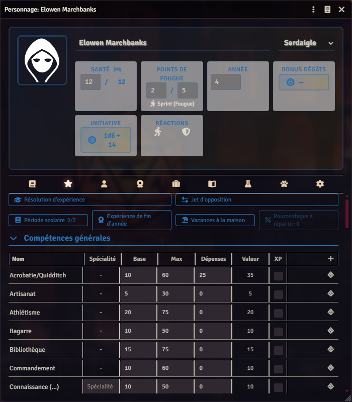

### L'en-tête

L'en-tête reste visible quel que soit l'onglet actif. Il contient tout ce qu'un MJ
demande en cours de partie :

| Champ | Détail |
|---|---|
| **Santé** | Points de vie courants / maximum. Le maximum est dérivé de CON et TAI. |
| **Points de Fougue** | Réserve courante / maximum (5). Le lien *Sprint (Fougue)* déclenche la course du §1.7.7. |
| **Année** | Année scolaire, de 1 à 7. Pilote le plafond des matières scolaires. |
| **Bonus dégâts** | Dérivé de FOR + TAI. Cliquable : lance directement les dégâts à mains nues. |
| **Initiative** | Formule `1d6 + DEX`. Cliquable : lance l'initiative et l'inscrit dans le tracker. |
| **Réactions** | Deux boutons : esquive et parade. |

Le sélecteur de **maison**, en haut à droite, applique le thème de la maison à toute
la fenêtre (bleu Serdaigle sur la capture).

### Les onglets

La barre d'onglets affiche des icônes par défaut ; le réglage *Utiliser des icônes
pour les onglets* permet de repasser à des libellés textuels.

| Onglet | Contenu |
|---|---|
| **Biographie** | Famille, apparence, caractère, archétype, équipe de Quidditch |
| **Caractéristiques** | Les huit caractéristiques et les valeurs dérivées (Idée, Chance, sens…) |
| **Compétences** | Toutes les compétences, l'expérience et les jets d'opposition |
| **Avantages** | Avantages, désavantages, faveurs et disgrâces du destin |
| **Équipement** | Armes, protections, balais, objets, argent |
| **Sorts** | Sortilèges connus, classés par niveau |
| **Potions** | Potions préparées ou en réserve |
| **Familier** | Familier lié |
| **Paramètres** | Options propres à cette fiche |

### La table des compétences

Les colonnes ont chacune un rôle précis :

| Colonne | Rôle |
|---|---|
| **Base** | Valeur de départ imposée par le livre. Non modifiable. |
| **Max** | Plafond autorisé, dépendant de l'année pour les matières scolaires. |
| **Dépenses** | **La seule case que vous remplissez.** Points investis dans la compétence. |
| **Valeur** | `Base + Dépenses`, corrigée par le coût progressif. C'est le score du jet. |
| **XP** | Case à cocher marquant la compétence comme « à faire progresser ». |

Le bouton `+` en bout de ligne lance un jet sur la compétence.

> **Attention** : la progression n'est pas linéaire. Investir 25 points dans une
> compétence ne donne pas toujours +25 % — c'est normal, le coût augmente avec le
> niveau atteint. Sur la capture, *Acrobatie/Quidditch* affiche 25 dépenses pour une
> valeur de 35 (base 10).

---

## 4. Faire un jet

### Déclencher le jet

Cliquez sur l'icône de dé en bout de ligne d'une compétence, sur une valeur dérivée
(Idée, Chance…), ou sur un sort ou une potion dans les onglets correspondants.

### Le dialogue de modificateur

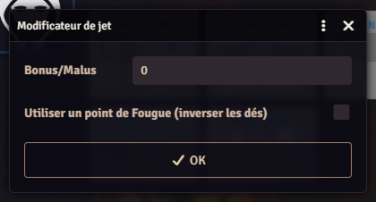

Chaque jet en pourcentage ouvre d'abord ce dialogue :

- **Bonus/Malus** : modificateur de circonstance, en points de pourcentage. C'est ici
  que vous appliquez les difficultés que vous décidez comme MJ.
- **Utiliser un point de Fougue** : voir la [section 5](#5-la-fougue). La case n'est
  proposée que si le personnage a encore des points.

Le seuil final tient également compte, sans que vous ayez à y penser :

- le **malus propre du sort ou de la potion** ;
- l'**affinité de baguette** (+10 % si la baguette mentionne l'école du sort) ;
- les malus de **sans baguette** (−75 %) et d'**informulé** (−30 %) ;
- le **stress** courant, retranché du seuil.

### La carte de résultat

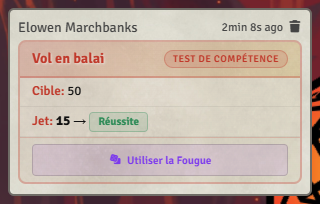

La carte publie systématiquement la **cible finale** et le **jet**, pour que la table
puisse vérifier le calcul. Le badge indique le degré :

| Résultat | Degré |
|---|---|
| `01`–`05` | Réussite critique |
| `96`–`00` | Maladresse |
| ≤ cible | Réussite |
| > cible | Échec |

La **maladresse est évaluée avant la réussite** : un `96` reste une maladresse même si
la cible dépasse 96, conformément au livre. Un réglage facultatif ajoute les paliers
*Extrême* et *Difficile* empruntés au BRP générique ; il est désactivé par défaut car
la source ne les définit pas.

Le bouton **Utiliser la Fougue** sous la carte permet de dépenser un point *après*
coup — voir la section suivante.

### Jets en opposition

Le livre publie **deux** mécaniques d'opposition, qu'il ne faut pas confondre.

**Caractéristique contre caractéristique** — la table des résistances du §1.5. Le
bouton **Jet d'opposition**, en haut de l'onglet *Compétences*, demande la valeur
active et la valeur passive, puis lance le jet sous le pourcentage qui en découle :
`50 + (active − passive) × 5`, borné à 5-95 comme la table imprimée.

**Compétence contre compétence** — la règle du §28.3.4, que le livre emploie aussi
dans les exemples de combat du chapitre 2 (esquive l. 3067, bagarre l. 3081). Chaque
ligne de compétence porte une **icône balance** à côté du dé : elle publie la
**différence** du jet (`valeur − résultat`) au lieu du degré de réussite.

Une fois deux différences publiées, le bouton **Résoudre une opposition** — présent
dans les tableaux de bord du duel et du Quidditch — compare la paire de votre choix :

- la plus haute différence l'emporte ;
- une **gêne** se soustrait à celui qui agit, comme dans l'exemple `40 − 10 − 28 = 2`
  du livre ;
- à égalité, l'action revient au **premier dans l'ordre d'initiative**.

Une différence négative reste comparable : deux échecs se départagent donc normalement.

---

## 5. La Fougue

La Fougue (chapitre 8) est entièrement automatisée.

- Chaque personnage dispose d'une réserve de **5 points** maximum, affichée dans
  l'en-tête.
- Le point peut être déclaré **avant** le jet, via la case du dialogue, ou **après**,
  via le bouton *Utiliser la Fougue* de la carte de chat. Le second mode se désactive
  au besoin (réglage *Fougue utilisable après le jet*), pour coller strictement au
  livre qui exige une déclaration préalable.
- Le système propose alors d'**inverser les dizaines et les unités** : un `74` devient
  un `47`. C'est un **choix**, pas une obligation — une boîte de dialogue vous demande
  de garder ou d'inverser, et la carte de chat indique laquelle des deux options a été
  retenue.
- **Le point est dépensé dans tous les cas**, y compris sur un palindrome (`44`, `55`)
  où l'inversion ne change rien. Le livre le précise explicitement.
- Par défaut, **un échec obtenu alors qu'un point de Fougue a été dépensé est traité
  comme une maladresse**. Décochez *Échec avec Fougue = maladresse* si vous préférez
  en faire un simple échec.

Le lien **Sprint (Fougue)** de l'en-tête applique la règle de course-poursuite du
§1.7.7.

---

## 6. Magie

### L'onglet Sorts

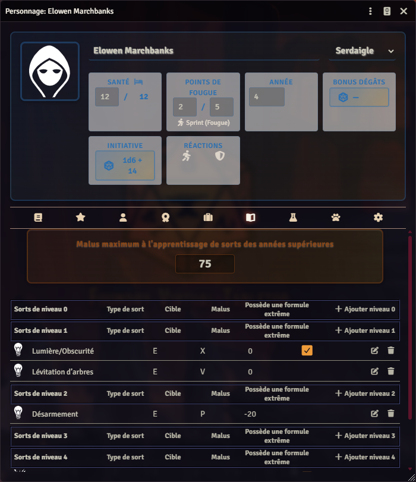

Les sortilèges sont regroupés **par niveau**, de 0 à 5 et plus. Chaque ligne affiche
le type de sort, la cible, le malus et la présence d'une formule extrême.

Le bandeau du haut, **Malus maximum à l'apprentissage de sorts des années
supérieures**, reprend la valeur d'INTelligence × 5 du personnage : c'est le malus
maximal qu'il peut absorber pour apprendre un sort au-dessus de son année.

Pour ajouter un sort : glissez-le depuis le compendium *Hogwarts Spells*, ou utilisez
le bouton **+ Ajouter niveau N** de la section voulue.

### La fiche d'un sort

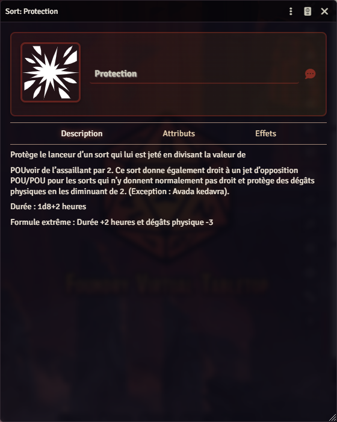

L'onglet *Description* contient le texte du sort tel qu'il figure dans le *Grimoire*,
y compris sa durée et sa formule extrême.

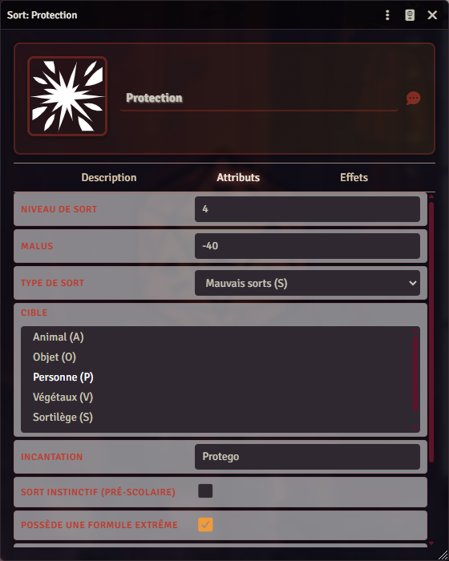

L'onglet *Attributs* contient tout ce qui pilote l'automatisation :

| Champ | Effet mécanique |
|---|---|
| **Niveau de sort** | Détermine la section d'affichage et le malus d'apprentissage |
| **Malus** | Retranché du seuil au moment du lancer |
| **Type de sort** | École : Enchantements (E), Métamorphose (M), Mauvais sorts (S)… |
| **Cible** | Animal, Objet, Personne, Végétaux, Sortilège |
| **Incantation** | Formule prononcée, affichée dans la carte de chat |
| **Sort instinctif (pré-scolaire)** | Le jet se fait sous POU × 3 au lieu de la compétence d'école |
| **Possède une formule extrême** | Active le choix « formule extrême » au moment du lancer |

### Lancer un sort

Cliquez sur l'icône du sort dans l'onglet *Sorts*. Le système :

1. sélectionne automatiquement la **compétence d'école** correspondante — ou POU × 3
   pour un sort instinctif ;
2. applique le **malus du sort** ;
3. ajoute l'**affinité de baguette** si elle correspond ;
4. propose, le cas échéant, le lancer en **formule extrême** ;
5. ouvre le dialogue de modificateur, puis publie la carte.

**Sans baguette** (−75 %) et **informulé** (−30 %) se cumulent avec le malus du sort.

> **Formule extrême** : la maîtriser abaisse durablement le malus du sort de base. Les
> livres la notent `FE : A%/B%`, où `A` est le malus une fois la formule maîtrisée et
> `B` celui du lancer en mode extrême.

### Legilimancie et Occlumancie

Les deux compétences ne sont **pas** acquises par tout le monde : elles viennent des
avantages *Legilimens* et *Occlumens*, qui les ouvrent à 15 % (maîtrise maximale
80 %). La ligne apparaît sur la fiche dès que l'avantage est possédé et disparaît s'il
est retiré ; elle n'est jamais écrite en dur dans les données.

Un bouton **Pénétrer un esprit** s'affiche dans l'onglet *Avantages* du seul
personnage qui possède la Legilimancie. Il demande la cible parmi les acteurs dotés
d'Occlumancie, puis oppose les deux compétences. Trois issues :

| Résultat | Signification |
|----------|---------------|
| **L'esprit de la cible est pénétré** | Le Legilimens l'emporte |
| **L'intrusion échoue** | La défense l'emporte sans avoir réussi son propre jet |
| **L'intrusion se retourne** | La défense réussit **et** l'emporte : c'est le Legilimens dont les pensées s'ouvrent |

La proximité physique, le contact visuel et le calme de la cible modifient la
difficulté (§15.1) : traduisez-les par le modificateur proposé dans la boîte.

> **Extension maison.** Le chapitre 15 est entièrement descriptif : il ne publie ni dé
> ni chiffre. Résoudre l'intrusion par une opposition de compétences, et la retourner
> quand la défense réussit, sont une lecture de la phrase du §15.1 « Dangers »
> (l. 24365). Le livre n'y attache aucun nombre, et la carte de chat le rappelle.

---

## 7. Potions

L'onglet *Potions* fonctionne comme celui des sorts. Chaque potion porte son niveau,
sa **virulence**, sa rareté, ses doses et ses ingrédients, extraits du *Grimoire*.

Deux points à connaître :

- Le **temps de préparation** est volontairement vide. Le livre ne le publie pas :
  il est laissé à l'appréciation du MJ.
- La **virulence** et la **durée** sont renseignées lorsque le *Grimoire* les publie
  dans le texte de la potion.

Les ingrédients sont des objets à part entière (compendium *Hogwarts Components*), ce
qui permet de gérer une réserve et des quêtes de récolte.

---

## 8. Combat

### Ouvrir un combat

Déposez les jetons sur la scène, sélectionnez-les, puis **Créer un combat** dans
l'onglet *Combat* de la barre latérale. L'initiative se lance depuis le tracker ou en
cliquant sur la valeur *Initiative* d'une fiche.

### Initiative et phases

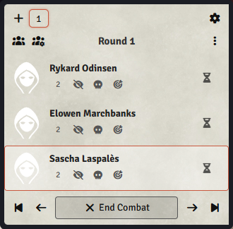

L'initiative est `1d6 + DEX`. Par défaut elle est **relancée à chaque round**,
conformément au §2.2 ; le réglage *Relancer l'initiative à chaque round* permet de
figer l'ordre.

Le petit bouton numéroté à côté de chaque nom est le **badge de phase** ajouté par le
système :

- **cliquez** pour faire tourner la phase déclarée (1 → 2 → 3) ;
- **Alt + clic** pour marquer le combattant comme **surpris** : il est renvoyé en
  troisième phase pour le round d'ouverture.

Le tri se fait d'abord par phase, puis par initiative décroissante. À égalité
parfaite, le livre tranche en faveur du joueur : le système fait de même.

### Réactions

Les deux icônes *Réactions* de l'en-tête déclenchent l'esquive et la parade. La
protection magique se lance depuis le sort correspondant.

### Dégâts, blessures et récupération

- Les dégâts s'appliquent depuis les boutons des cartes de chat, sur les jetons
  **ciblés** ou **sélectionnés**.
- La **réduction d'armure** est déduite automatiquement si le réglage *Soustraire
  l'armure aux dégâts* est actif.
- Les seuils d'inconscience, de mort et la récupération sont gérés par le système.
- L'**assommement** dispose de deux procédures, toutes deux publiées par le livre :
  table de résistance (§2.7.1) ou paliers de 25/50/75 % de perte de PV (§2.7.2). Le
  réglage *Méthode d'assommement* choisit laquelle est appliquée.

---

## 9. Duel magique

Le duel (chapitre 27) a ses propres règles, distinctes du combat : il dispose d'un
**tableau de bord** accessible par l'icône baguette des contrôles de scène. Comme le
Quidditch, il s'appuie sur une rencontre ouverte dans le tracker.

### Les règles convenues

Avant de commencer, les duellistes fixent les modalités (§27.1, §27.6). Le tableau de
bord les reprend :

| Réglage | Effet |
|---------|-------|
| **Type de duel** | `a` premier sort touchant · `b` mise hors combat · `c` première blessure · `d` duel à mort (§27.4) |
| **Nombre de passes** | 1 à 10 ; chaque passe est un round |
| **Modalités** | Informulés, sorts innés, sorts blessants et formules extrêmes, chacun autorisé ou interdit |

Dans les types `a` et `b`, le tableau rappelle que **1 point de dégât disqualifie**.
La disqualification reste un geste du MJ : lui seul sait si le dégât vient du sort ou
de la chute qui a suivi.

### Déclarer un sortilège

Chaque participant reçoit un rôle — **duelliste**, **témoin/second** ou **arbitre**
(§27.1). Seuls les duellistes déclarent un sort.

La liste ne propose que les sortilèges **autorisés dans le type de duel choisi**,
reprise de la table du §27.5 (67 entrées). Deux marques complètent l'affichage :

- **`*`** : le livre étoile le sort — il peut blesser ou tuer dans certains cas ;
- **`?`** : le nom figure dans la table du livre mais ne correspond à aucun
  sortilège publié, ni dans le livre de base ni dans le Grimoire. Ils sont conservés
  tels quels plutôt que rapprochés d'un candidat plausible : c'est une incohérence de
  la source, et vous devez la voir.

Les Impardonnables ne sont proposés que dans le duel à mort.

### L'ordre de résolution

Le duel remplace les phases de combat par l'**échelle de priorité** du §27.3. Le rang
s'affiche dans le tracker à la place du badge de phase habituel :

| Rang | Sortilèges | Initiative |
|------|-----------|-----------|
| **P1** | Innés | — |
| **P2** | Protection | — |
| **P3** | Informulés | **+3** |
| **P3** | Classiques | — |
| **P4** | Formules extrêmes | **−3** |

La colonne de priorité imprimée dans la table du §27.5 fait foi ; seuls les modes
*inné* et *formule extrême* la surchargent.

Le bouton **dé** de chaque duelliste lance `1d6 + DEX`, augmenté du modificateur de
mode et de l'entraînement. Si le personnage a des points de fougue, le système propose
de **relancer le d6 avec un bonus de +2** (l. 28683) — le choix se fait avant de
connaître l'ordre adverse, comme le veut le livre.

### L'entraînement au duel

Le champ **Années de club de duel** de l'onglet *Avantages* vaut **+1 à l'initiative
de duel par année, jusqu'à +5** (§27.2). Il se cumule avec l'avantage *Initié au
duel* (+2), exactement comme dans l'exemple de Mary Macmilliam.

> L'avantage est livré comme un effet **conditionnel**. S'il est activé, son +2 est
> déjà compté dans le modificateur d'initiative de la fiche et le tableau de bord ne
> l'ajoute pas une seconde fois. Le total est le même quel que soit votre réglage.

### Lancer le sort déclaré

Le bouton **baguette** applique automatiquement le degré de maîtrise dans la
compétence associée, le malus du sort, le stress, et les **−30 %** d'un informulé.

- Une **formule extrême** n'est prise en compte que si le sort en possède une. La
  plupart affichent « Formule extrême : - » : dans ce cas le malus normal s'applique
  et la boîte de lancement vous le signale.
- Un **sort inné** ne rate jamais. Sur une opposition, un jet manqué compte comme une
  réussite de différence 0 (l. 23197).

La carte publie la **différence** du jet, prête pour le résolveur d'opposition.

---

## 10. Progression et expérience

Tous les outils sont réunis en haut de l'onglet *Compétences* :

| Bouton | Usage |
|---|---|
| **Résolution d'expérience** | Résout les compétences cochées « XP » à la fin d'une séance |
| **Période scolaire** | Applique le gain de fin de période ; le compteur `0/3` suit l'avancement de l'année |
| **Expérience de fin d'année** | Applique le gain annuel |
| **Vacances à la maison** | Applique les gains hors période scolaire |
| **Pourcentages à répartir** | Réserve de points en attente d'affectation |

Le réglage *Gain d'expérience scolaire* choisit entre les deux barèmes contradictoires
du livre : le forfait `1d6+1` par période (§25.1) ou le tableau dégressif
`1d6+1 / 1d4+1 / 1d4` selon l'ancienneté de la matière (§7.3).

Le réglage *Avertir en cas d'expérience négative* affiche une notification si une
dépense fait passer un total sous zéro — utile pour rattraper une saisie erronée.

---

## 11. Points de maison

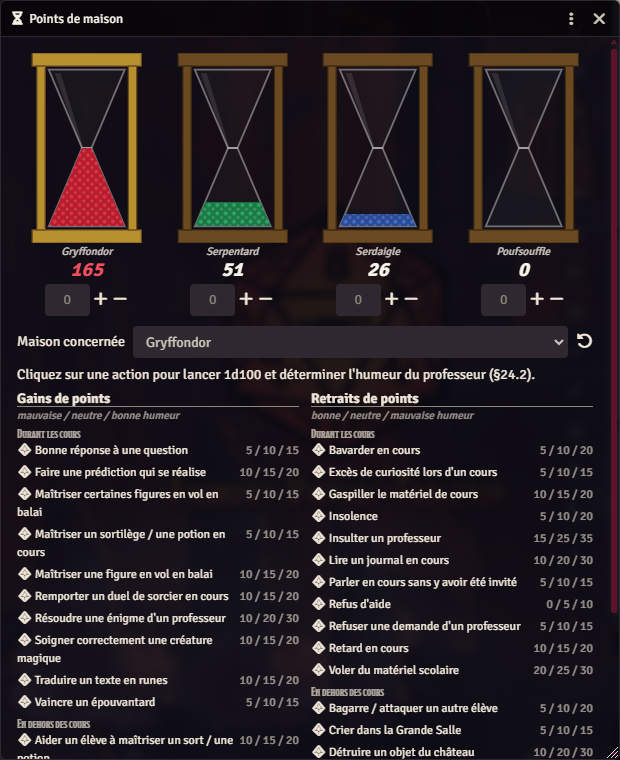

L'outil se trouve dans la barre d'outils de scène, icône **sablier**. Il est partagé
par tout le monde : les joueurs voient les sabliers se remplir en direct.

- Les quatre sabliers affichent le total de chaque maison.
- Le champ numérique sous chaque sablier, avec `+` et `−`, applique un ajustement
  manuel.
- Le sélecteur **Maison concernée** désigne la maison qui subira la prochaine action.
- Les deux colonnes listent les **gains** et les **retraits** publiés par le livre,
  avec trois valeurs correspondant à l'humeur du professeur
  (*mauvaise / neutre / bonne*).

**Cliquer sur une action lance `1d100`** pour déterminer l'humeur du professeur
(§24.2) et applique automatiquement le nombre de points correspondant, avec une carte
de chat justifiant l'attribution.

Le bouton de réinitialisation, à droite du sélecteur, remet les quatre compteurs à
zéro — typiquement en fin d'année scolaire.

---

## 12. Quidditch

Le Quidditch (chapitre 28) dispose d'un sous-système complet : un **tableau de bord de
match** et un **type d'acteur « Équipe de Quidditch »**.

### L'acteur Équipe

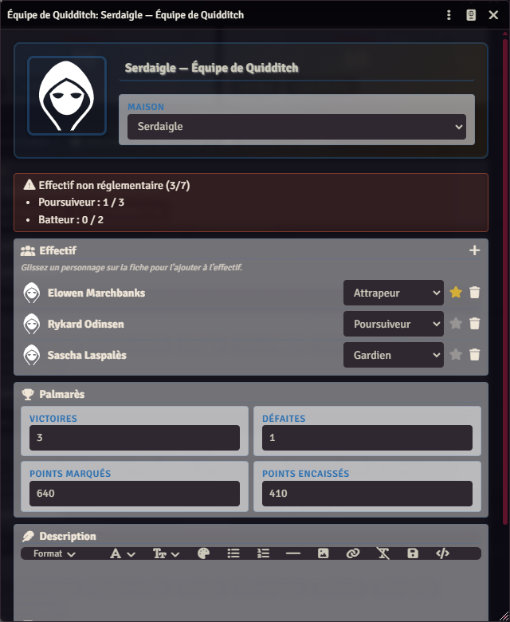

Créez-le comme n'importe quel acteur : *Acteurs → Créer un acteur → type
`Équipe de Quidditch`*. La fiche prend le thème de la maison choisie.

- **Effectif** : glissez-déposez des personnages sur la fiche pour les ajouter, puis
  choisissez leur poste. L'étoile désigne le **capitaine**.
- Le bandeau du haut **vérifie la composition réglementaire** en permanence :
  3 poursuiveurs, 2 batteurs, 1 gardien, 1 attrapeur. Sur la capture, il signale
  qu'il manque deux poursuiveurs et les deux batteurs.
- **Palmarès** : victoires, défaites, points marqués et encaissés, pour suivre une
  saison.
- L'appartenance à une équipe apparaît automatiquement sur la **fiche de personnage**,
  dans l'onglet *Biographie*, sous forme d'un champ en lecture seule. Un clic ouvre la
  fiche de l'équipe.

Les équipes sont des acteurs : elles sont **persistantes**, exportables, partageables
et gérables dans des dossiers comme le reste.

### Le tableau de bord de match

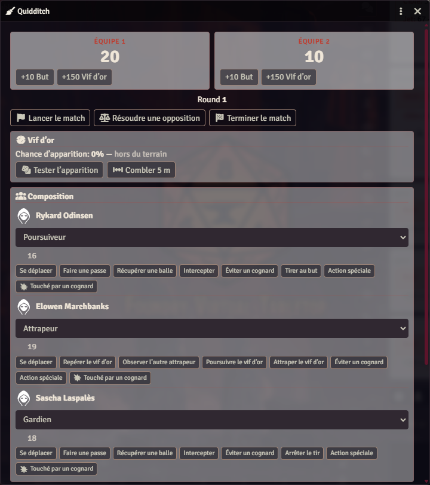

Icône **balai** dans la barre d'outils de scène. Le tableau de bord s'appuie sur le
**combat en cours** : créez d'abord un combat avec les joueurs concernés.

1. **Lancer le match** : effectue le tirage de possession (`1d2`) et bascule le combat
   en mode Quidditch.
2. **Composition** : attribuez un poste à chaque combattant. Chaque poste affiche ses
   propres actions — un poursuiveur peut *Tirer au but*, un gardien *Arrêter le tir*,
   un attrapeur *Repérer le vif d'or*.
3. **Score** : `+10 But` et `+150 Vif d'or` pour chaque camp. La prise du vif d'or
   termine le match. Les boutons ne font qu'**ajouter** : pour corriger une erreur de
   saisie, utilisez le champ **± sous chaque score**, ou **Remettre le score à zéro**
   qui conserve la composition et l'état du vif d'or. Un score ne descend jamais sous
   zéro, et chaque correction est publiée dans le chat.
4. **Vif d'or** : la chance d'apparition augmente à chaque round. *Tester
   l'apparition* effectue le jet ; une fois le vif repéré, *Combler 5 m* réduit la
   distance qui sépare l'attrapeur de la balle.
5. **Résoudre une opposition** : ouvre le résolveur décrit en
   [section 4](#4-faire-un-jet), pour les actions opposées (interception, arrêt, duel
   d'attrapeurs).
6. **Terminer le match** : publie le score final et rebascule le combat en mode normal.

En mode Quidditch, le tracker de combat remplace le badge de phase par le **poste** de
chaque joueur, et l'ordre du tour suit les postes plutôt que l'initiative :

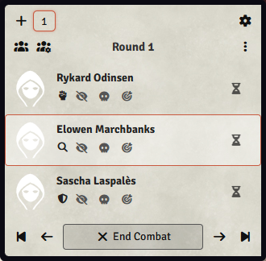

---

## 13. Créatures, familiers et PNJ

| Type d'acteur | Usage |
|---|---|
| `Personnage` | Personnage joueur complet |
| `PNJ` | Personnage non joueur, avec un facteur de puissance servant au calcul d'expérience |
| `Familier` | Familier lié à un personnage, avec ses propres compétences et avantages |
| `Créature` | Créature du *Bestiaire* ou de l'*Encyclopédie* |

Les créatures sont livrées prêtes à l'emploi dans le compendium *Hogwarts Creatures* :
glissez-en une sur la scène et elle est jouable immédiatement.

Un familier se lie à son maître depuis l'onglet *Familier* de la fiche du personnage ;
ses jets et ses dégâts sont alors accessibles directement depuis la fiche du maître.

---

## 14. Les compendiums

| Compendium | Type | Documents | Source |
|---|---|---:|---|
| Hogwarts Spells | Objets | 366 | *Grimoire* + livre de base |
| Hogwarts Potions | Objets | 139 | *Grimoire* |
| Hogwarts Components | Objets | 310 | *Grimoire* |
| Hogwarts Creatures | Acteurs | 162 | *Bestiaire* + *Encyclopédie* |
| Hogwarts Features | Objets | 30 | Livre de base |

Utilisation courante :

- **Glisser-déposer** un document du compendium vers une fiche pour l'ajouter.
- **Clic droit → Importer** pour en obtenir une copie modifiable dans le monde.
- La barre de recherche du compendium accepte le nom français comme l'incantation.

Les compendiums sont **régénérés à partir des tableaux des livres**. Ils ne
contiennent aucun texte de règle recopié : vous devez posséder les ouvrages.

---

## 15. Réglages du monde

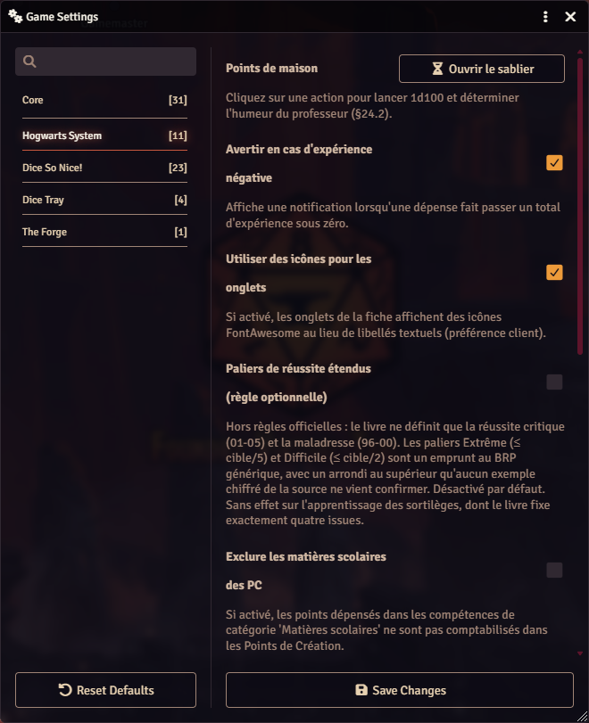

*Configuration → Réglages → Hogwarts System*.

| Réglage | Défaut | Effet |
|---|---|---|
| **Points de maison** | — | Ouvre le sablier (voir section 11) |
| **Avertir en cas d'expérience négative** | activé | Notifie si une dépense passe sous zéro |
| **Utiliser des icônes pour les onglets** | activé | Icônes plutôt que libellés. Préférence **client** |
| **Paliers de réussite étendus** | désactivé | Ajoute *Extrême* et *Difficile*, empruntés au BRP. Hors règles officielles |
| **Exclure les matières scolaires des PC** | désactivé | Les matières scolaires ne consomment plus de Points de Création |
| **Méthode d'assommement** | Alternative | Table de résistance (§2.7.1) ou paliers 25/50/75 % (§2.7.2) |
| **Soustraire l'armure aux dégâts** | activé | Applique la réduction d'armure automatiquement (§2.8.1) |
| **Relancer l'initiative à chaque round** | activé | Conforme au §2.2 |
| **Gain d'expérience scolaire** | Forfait `1d6+1` | Arbitre entre §25.1 et §7.3 |
| **Échec avec Fougue = maladresse** | activé | Un échec avec point de Fougue dépensé devient une maladresse |
| **Fougue utilisable après le jet** | activé | Affiche le bouton *Utiliser la Fougue* sur les cartes de chat |

> Les libellés signalent explicitement les réglages qui s'écartent des règles
> officielles ou qui arbitrent une contradiction de la source. Lisez l'infobulle avant
> de changer un défaut.

---

## 16. Extensions maison

Le système suit le livre partout où celui-ci tranche. Quelques éléments, en
revanche, **ne figurent dans aucune source** : ils sont listés ici pour que vous
ne les preniez pas pour du canon, et pour que vous puissiez les écarter à votre
table.

| Élément | Ce que dit la source | Ce que fait le système |
|---|---|---|
| **Paliers de réussite étendus** | Le livre ne définit que la réussite critique et la maladresse | Réglage *désactivé par défaut* ajoutant *Extrême* et *Difficile*, empruntés au BRP générique, avec un arrondi au supérieur qu'aucun exemple chiffré ne confirme |
| **Maîtrises de base et maximales** | Le fonctionnement est décrit (§6.10) mais **aucune table n'est publiée** — un seul couple chiffré en exemple | Plus de soixante couples `base`/`max` fournis par le système |
| **Bonus de dégâts des créatures** | Introuvable dans le livre de base, le *Bestiaire* et l'*Encyclopédie* | Table prolongée hors du domaine humain : −1d4, −1d2, +3d6, +4d6 |
| **Sorts instinctifs (POU × 3)** | Le principe d'une magie enfantine incontrôlée est évoqué ; **aucune résolution chiffrée** | Case « Sort instinctif » déclenchant un jet sous POU × 3 |
| **Animagus** | Le chapitre 16 publie le processus en dix étapes et un test de personnalité donnant la catégorie d'animal, mais **aucun jet de transformation** | Paliers de maîtrise et bouton de transformation (jet sous la compétence Animagus) |
| **Legilimancie contre Occlumancie** | Le chapitre 15 est **entièrement descriptif** : ni dé, ni chiffre. Seul le sort *Legilimens* porte une opposition POU/POU (l. 22189) | Opposition des deux compétences, et renversement contre le Legilimens quand la défense réussit — lecture de la phrase du §15.1 « Dangers » (l. 24365), à laquelle le livre n'attache aucun nombre |

> **Animagus — deux valeurs dans la source.** Le tableau des avantages annonce la compétence à
> 20 % (max 90 %), la fin du chapitre 16 à 10 % (max 80 %). Le système retient le chapitre dédié ;
> les colonnes *Base* et *Max* de la fiche restent modifiables si vous préférez l'autre lecture.
> Le questionnaire du §16.2 n'est pas reproduit — ses puces sont des dessins, illisibles hors du
> livre : la fiche propose directement les six profils de résultat.

Les trois premiers points sont signalés directement dans l'interface : survolez
les colonnes *Base* et *Max* de l'onglet Compétences, ou la case « Sort
instinctif » d'une fiche de sortilège. L'opposition mentale le signale dans sa
carte de chat.

### Trois sortilèges de la table des duels n'existent pas

La table du §27.5 nomme *Annulation de sort*, *Immobilisation totale* et
*Explosion* : aucun de ces trois noms ne correspond à un sortilège publié, ni dans
le livre de base, ni dans le Grimoire. Ils sont **conservés tels quels et marqués
d'un « ? »** plutôt que rapprochés d'un candidat plausible : c'est une incohérence
de la source, et le choix vous revient. Deux autres n'étaient que des coquilles et
ont été rapprochées sans ambiguïté : *Jambencoton* et *Mouche-Sadrines*.

---

## 17. Dépannage

**Une valeur ne veut pas changer.**
Elle est dérivée. Cherchez ce qui l'alimente : la *Valeur* d'une compétence vient de
*Base + Dépenses*, les PV viennent de CON et TAI, le bonus de dégâts de FOR et TAI.

**Le thème de couleur ne correspond pas à la maison.**
Le thème suit le sélecteur de maison de l'en-tête. Refermez et rouvrez la fiche si le
changement vient d'être fait par un autre utilisateur.

**Une fenêtre déborde de l'écran.**
Toutes les fenêtres du système sont redimensionnables et défilables. Attrapez le coin
inférieur droit.

**Le tableau de bord de Quidditch dit qu'il n'y a pas de combat.**
Il s'appuie sur le combat en cours. Créez un combat avec les joueurs concernés avant
de lancer le match.

**L'ordre du tour semble figé après un match de Quidditch.**
Foundry ne recalcule l'ordre que lorsqu'une initiative change. Le système force le
recalcul en début et en fin de match ; si l'affichage reste décalé, cliquez sur une
valeur d'initiative pour forcer le rafraîchissement.

**Un sort ne prend pas en compte l'affinité de la baguette.**
Le champ *affinité* de la baguette doit mentionner l'école : « enchantements »,
« métamorphose » ou « mauvais sorts ».

**Le résolveur d'opposition dit qu'il manque des différences.**
Il lit les cartes de chat récentes. Chaque camp doit d'abord publier la sienne, par
l'icône balance d'une ligne de compétence, par une action de Quidditch opposée ou
par un sort lancé en duel.

**Un duelliste n'apparaît pas au bon rang.**
Le tri suit la **priorité du sort déclaré**, pas l'initiative seule. Un sort de
protection passe toujours avant un sort classique, quelle que soit l'initiative.
Déclarez le sort avant de lancer l'initiative.

**Le bonus d'« Initié au duel » semble manquer.**
Il est bien là : si vous avez activé l'effet conditionnel de l'avantage, son +2 est
déjà compté dans le modificateur d'initiative de la fiche, et la ligne
*Entraînement* de la carte ne montre alors que les années de club.

---

## 18. Aide-mémoire

### Degrés de réussite

| Jet | Résultat |
|---|---|
| `01`–`05` | Réussite critique |
| ≤ cible | Réussite |
| > cible | Échec |
| `96`–`00` | Maladresse (évaluée en premier) |

### Modificateurs cumulés sur un lancer de sort

| Source | Modificateur |
|---|---|
| Malus du sort | Variable, indiqué sur la fiche du sort |
| Sans baguette | −75 % |
| Informulé | −30 % |
| Affinité de baguette | +10 % |
| Stress | −1 % par point de stress |
| Circonstances | Au choix du MJ, dans le dialogue |

### Composition réglementaire d'une équipe de Quidditch

| Poste | Nombre |
|---|---|
| Poursuiveur | 3 |
| Batteur | 2 |
| Gardien | 1 |
| Attrapeur | 1 |
| **Total** | **7** |

### Score au Quidditch

| Action | Points |
|---|---|
| But | 10 |
| Prise du vif d'or | 150, et fin du match |

### Raccourcis du tracker de combat

| Geste | Effet |
|---|---|
| Clic sur le badge numéroté | Fait tourner la phase déclarée (1 → 2 → 3) |
| Alt + clic sur le badge | Marque ou retire l'état **surpris** |

En duel, le badge numéroté est remplacé par le **rang de priorité** (`P1` à `P4`),
qui se règle en déclarant un sortilège, pas en cliquant.

### Priorités et initiative en duel

| Rang | Sortilèges | Initiative |
|---|---|---|
| `P1` | Innés | — |
| `P2` | Protection | — |
| `P3` | Informulés | +3 |
| `P3` | Classiques | — |
| `P4` | Formules extrêmes | −3 |

Bonus d'entraînement : **+1 par année de club** (maximum +5), cumulable avec
l'avantage *Initié au duel* (+2).

### Les deux oppositions

| Mécanique | Source | Quand |
|---|---|---|
| Table des résistances | §1.5 | Une caractéristique contre une autre |
| Comparaison des différences | §28.3.4 | Une compétence contre une autre |

Différence = `valeur effective − résultat du dé`. La plus haute l'emporte ; à égalité,
le premier dans l'ordre d'initiative.

---

*Ce guide accompagne le système Hogwarts System pour Foundry VTT. Les règles
elles-mêmes appartiennent au jeu de rôle amateur* Harry Potter JdR *et à ses
suppléments, que ce système ne reproduit pas.*
